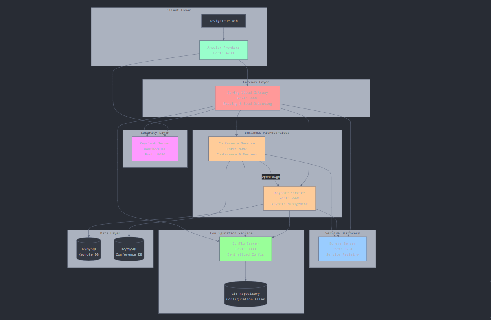
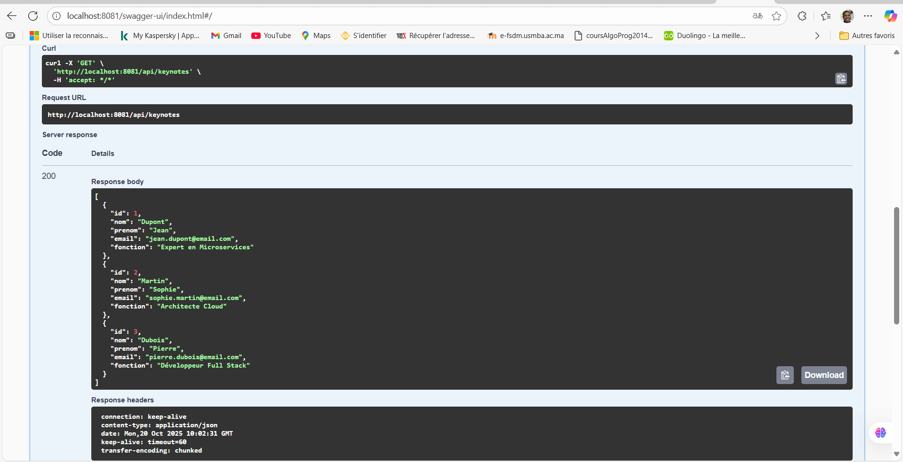

# Conference Hub Microservices App

Une application basée sur une architecture micro-services pour la gestion des conférences et des keynote speakers. L'application permet de gérer les conférences avec leurs reviews et les keynote speakers associés.

## Objectif et Concept

L'objectif est de développer une plateforme distribuée pour la gestion des conférences académiques et commerciales. Chaque conférence peut recevoir des reviews, et les keynote speakers sont gérés séparément. L'architecture micro-services assure la scalabilité, la maintenabilité et la tolérance aux pannes.

### Concepts Clés
- **Micro-services** : Séparation des préoccupations avec des services dédiés pour les conférences et les keynote.
- **Service Discovery** : Utilisation d'Eureka pour l'enregistrement automatique des services.
- **Configuration Centralisée** : Spring Cloud Config pour gérer les configurations.
- **Gateway** : Point d'entrée unique avec Spring Cloud Gateway.
- **Communication** : OpenFeign pour les appels inter-services.
- **Documentation** : Swagger/OpenAPI pour la documentation des APIs.
- **Fault Tolerance** : Resilience4J pour les circuit breakers.
- **Sécurité** : OAuth2/OIDC avec Keycloak (à implémenter).
- **Frontend** : Application Angular (à implémenter).
- **Déploiement** : Docker et Docker Compose (à implémenter).

## Architecture

L'architecture suit les principes des systèmes distribués avec les composants suivants :

- **Keynote Service** : Gestion CRUD des keynote speakers.
- **Conference Service** : Gestion des conférences et des reviews, avec communication vers Keynote Service via OpenFeign.
- **Discovery Service** : Enregistrement et découverte des services avec Eureka.
- **Config Service** : Centralisation des configurations.
- **Gateway Service** : Routage des requêtes entrantes.
- **Frontend Angular** : Interface utilisateur.
- **Keycloak** : Authentification et autorisation.
- **Base de données** : H2 en développement.



## Structure du Projet

Le projet est organisé en modules Maven :
- `keynote-service/` : Service pour les keynote.
- `conference-service/` : Service pour les conférences et reviews.
- `gateway-service/` : Gateway pour le routage.
- `discovery-service/` : Service de découverte Eureka.
- `config-service/` : Service de configuration.
- `angular-front-app/` : Application frontend (à implémenter).

## Technologies Utilisées

- **Backend** : Spring Boot, Spring Cloud (Gateway, Config, Eureka), JPA/Hibernate, H2 Database.
- **Communication** : OpenFeign, RESTful APIs.
- **Documentation** : Swagger/OpenAPI.
- **Fault Tolerance** : Resilience4J.
- **Frontend** : Angular (à implémenter).
- **Sécurité** : Keycloak (à implémenter).
- **Déploiement** : Docker, Docker Compose (à implémenter).
- **Outils** : Maven, IntelliJ IDEA.

## Installation et Configuration

### Prérequis
- Java 17+
- Maven 3.6+
- IntelliJ IDEA (recommandé)
- Git

### Étapes d'Installation
1. Cloner le repository :
   ```bash
   git clone <repository-url>
   cd conference-hub-microservices-app
   ```

2. Importer dans IntelliJ IDEA :
   - Ouvrir IntelliJ IDEA.
   - Sélectionner "File > Open" et choisir le dossier racine du projet.
   - IntelliJ détectera automatiquement les modules Maven.

3. Configurer les services :
   - Assurer que les ports sont libres : 8761 (Discovery), 8888 (Config), 8080 (Gateway), 8081 (Keynote), 8082 (Conference).
   - Les configurations sont dans `src/main/resources/application.properties` pour chaque service.

4. Démarrer les services dans l'ordre :
   - Config Service : `mvn spring-boot:run` dans `config-service/`
   - Discovery Service : `mvn spring-boot:run` dans `discovery-service/`
   - Keynote Service : `mvn spring-boot:run` dans `keynote-service/`
   - Conference Service : `mvn spring-boot:run` dans `conference-service/`
   - Gateway Service : `mvn spring-boot:run` dans `gateway-service/`

5. Vérifier :
   - Eureka Dashboard : http://localhost:8761
   - Swagger Keynote : http://localhost:8081/swagger-ui.html
   - Swagger Conference : http://localhost:8082/swagger-ui.html

### Tests
- Exécuter les tests unitaires : `mvn test` dans chaque module.
- Pour les tests d'intégration, démarrer les services et utiliser Postman ou Swagger.

## Services Développés

### Keynote Service
- **Entités** : Keynote (id, nom, prénom, email, fonction).
- **Repository** : KeynoteRepository (JPA).
- **Service** : KeynoteService (logique métier CRUD).
- **DTO** : KeynoteRequestDTO, KeynoteResponseDTO.
- **Mapper** : KeynoteMapper (MapStruct).
- **Controller** : KeynoteController (endpoints REST /api/keynotes).
- **Documentation** : Swagger intégré.



### Conference Service
- **Entités** : Conference (id, titre, type, date, durée, nombreInscrits, score), Review (id, date, texte, stars).
- **Repository** : ConferenceRepository, ReviewRepository.
- **Service** : ConferenceService, ReviewService.
- **DTO** : ConferenceRequestDTO, ConferenceResponseDTO, ReviewRequestDTO, ReviewResponseDTO.
- **Mapper** : ConferenceMapper, ReviewMapper.
- **Controller** : ConferenceController, ReviewController.
- **Client Feign** : Communication avec Keynote Service.
- **Exceptions** : Gestion personnalisée des erreurs.

### Discovery Service
- Basé sur Eureka Server pour l'enregistrement des services.

### Config Service
- Spring Cloud Config Server pour la configuration centralisée.

### Gateway Service
- Spring Cloud Gateway pour le routage des requêtes vers les services appropriés.

## Frontend Angular
- À implémenter : Application simple pour interagir avec les APIs via la gateway.

## Sécurité avec Keycloak
- À implémenter : Authentification OAuth2/OIDC.

## Déploiement Docker
- À implémenter : Conteneurisation avec Docker et orchestration via Docker Compose.

## Contribution
Contributions bienvenues ! Veuillez suivre les bonnes pratiques de développement et ajouter des tests pour les nouvelles fonctionnalités.

## Licence
Ce projet est sous licence MIT.